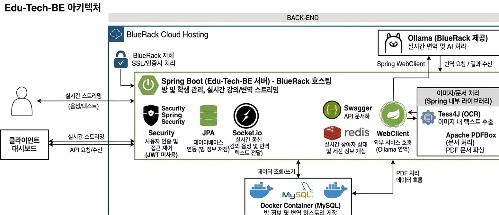

# EduTech Backend: 교육 사각지대를 줄이기 위한 실시간 학습 지원 서버

EduTech Backend는 대면 교육 현장에서 청각장애인, 외국인 학생 등 정보 접근에 어려움을 겪는 학습자를 위해 실시간 자막 및 번역 기능을 지원하는 백엔드 시스템입니다.

강의실 내 음성 중심 전달 방식의 한계를 보완하고, 학습자의 이해와 참여를 돕는 것을 목표로 합니다.

---

## 1. 프로젝트 개요

대면 수업 환경에서는 강사의 설명이 음성 중심으로 전달되기 때문에  
청각장애인이나 언어 장벽이 있는 외국인 학생은 수업을 따라가기 어려운 문제가 존재합니다.

본 프로젝트는 이러한 교육 사각지대를 해결하기 위해 기획되었습니다.  
실시간 정보 전달과 번역 기능을 통해, 학습자가 수업 내용을 보다 쉽게 이해할 수 있도록 지원합니다.

---

## 2. 프로젝트 목표

- 청각장애인과 외국인 학생의 수업 접근성 향상
- 대면 교육 환경에서 실시간 정보 전달 지원
- 번역 기능을 통한 언어 장벽 해소
- 간편한 참여 구조를 통한 사용자 경험 개선

---

## 3. 핵심 기능

- 강의실 생성 및 참여 기능
- 인증 코드 기반 간편 입장 구조
- 실시간 정보 전달을 위한 API 제공
- Ollama 기반 번역 기능
- OCR 및 문서 텍스트 추출 지원
- 사용자 및 세션 상태 관리

---

## 아키텍쳐

## 4. 기술 스택

### Backend
- Java
- Spring Boot
- Spring Web / WebFlux

### Real-time
- WebSocket

### Security
- Spring Security 기반 접근 제어

### Database
- MySQL
- JPA (Hibernate)

### AI / Text Processing
- Ollama (번역 및 텍스트 처리)
- Tess4J (OCR)
- Apache PDFBox (문서 처리)

---

## 5. 시스템 구조

- Client → Spring Boot API Server
- API Server → MySQL
- WebSocket을 통한 실시간 데이터 전달
- Spring Security 기반 요청 접근 제어
- Ollama를 활용한 번역 및 텍스트 처리 수행

---

## 6. 설계 특징

### 1) 접근성을 고려한 참여 구조
복잡한 로그인 절차 대신 인증 코드 기반 입장 방식을 적용하여  
사용자가 빠르게 수업에 참여할 수 있도록 설계했습니다.

### 2) 대면 교육 환경 중심 설계
온라인 플랫폼이 아닌 실제 강의실 환경에서의 사용성을 고려하여,  
실시간 정보 전달과 즉시 접근성에 초점을 맞췄습니다.

### 3) 실시간 처리 구조
WebSocket 기반 통신을 활용하여  
강의 중 발생하는 정보를 실시간으로 전달할 수 있도록 설계했습니다.

### 4) AI 기반 번역 처리
Ollama를 활용하여 텍스트를 실시간으로 번역함으로써  
외국인 학습자의 이해를 돕고 학습 접근성을 향상시켰습니다.

---

## 7. 기대 효과

- 청각장애인의 수업 이해도 및 참여도 향상
- 외국인 학생의 실시간 학습 지원
- 교육 참여 격차 완화
- 대면 교육 환경의 접근성 개선

---

## 8. 향후 개선 방향

- 실시간 자막 정확도 향상
- 번역 품질 개선 및 다국어 확장
- 사용자 맞춤형 학습 지원 기능 추가
- 실제 교육 현장 적용 및 피드백 반영

---

## 9. 프로젝트 의의

본 프로젝트는 단순한 기능 구현을 넘어,  
기술을 통해 교육 환경의 정보 격차를 줄이고  
더 많은 학습자가 동등하게 참여할 수 있는 환경을 만드는 데 목적이 있습니다.

특히 제한된 시간 내 핵심 문제를 정의하고 해결하는 과정을 통해  
실제 서비스 설계 역량을 강화할 수 있었습니다.